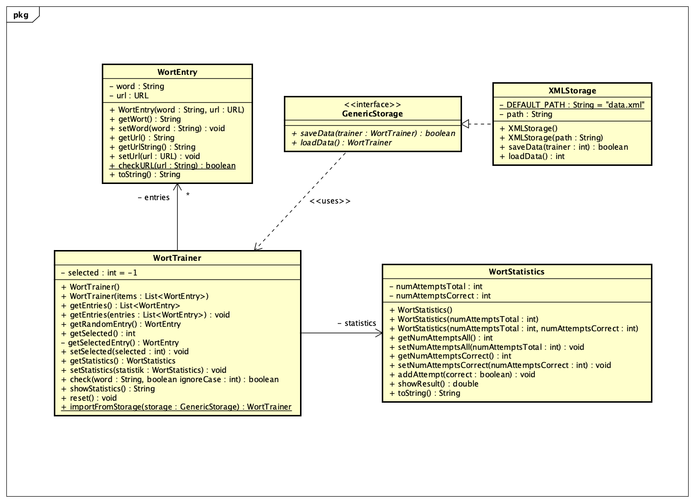

# [GK] 9a.1: Worttrainer Reloaded

## Aufgabenstellung

Für einen Rechtschreibtrainer für Wörter (Zielgruppe Volksschulkinder) soll ein entsprechendes Java-Programm erstellt werden. Die Kinder sollen dabei zu einem Bild (z.B. einem Hund) das entsprechende Wort eintippen. Dieses Wort wird dann mit der richtigen Schreibweise verglichen und eine entsprechende Meldung wird angezeigt. Dies soll über eine grafische Oberfläche geschehen.

## Lösung

Finales Konzept:

### Anwendungsbeispiel

Um die `Wort*`-Klassen spielerisch testen zu können, wurde eine einfache GUI-Anwendung mittels `JOptionPane` erstellt (Klasse `TrainerMain`), welche auch die Persistierung als XML-Datei anwendet.

### Persistierung

Die Persistierung ist im Package `persistence` implementiert. Ein Interface `GenericStorage` kann implementiert werden, um `WortTrainer`-Objekte zu speichern und zu laden, was Austauschbarkeit garantiert. Die bereits fertige Implementierung `XMLStorage` speichert die Objekte als XML-Datei.